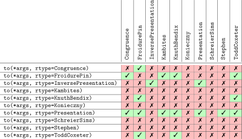

..
    Copyright (c) 2025 Joseph Edwards

    Distributed under the terms of the GPL license version 3.

    The full license is in the file LICENSE, distributed with this software.

.. currentmodule:: libsemigroups_pybind11

The ``to`` function
===================

This page contains links to the documentation of the uses of the function
:any:`to` for converting from one type of object in ``libsemigroups_pybind11``
to another type. These mostly only apply to the types implementing the main
algorithms in ``libsemigroups_pybind11``.

For example, to convert a :any:`ToddCoxeter` object ``tc`` to a
:any:`FroidurePin` object, you can simply do ``to(tc, rtype=(FroidurePin,))``.

A summary of the possible conversions available in ``libsemigroups_pybind11`` of
``to(FromType, rtype=(ToType,))`` are given below, where the rows correspond to
``ToType`` and the columns to ``FromType``:

A tick indicates that this conversion is implemented, and a cross that it is not
yet implemented.

Full API
--------

.. autofunction:: libsemigroups_pybind11.to
